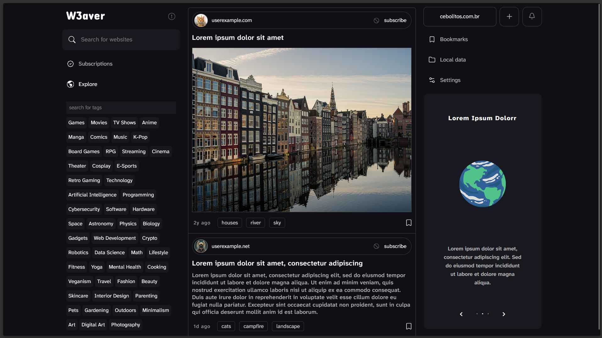
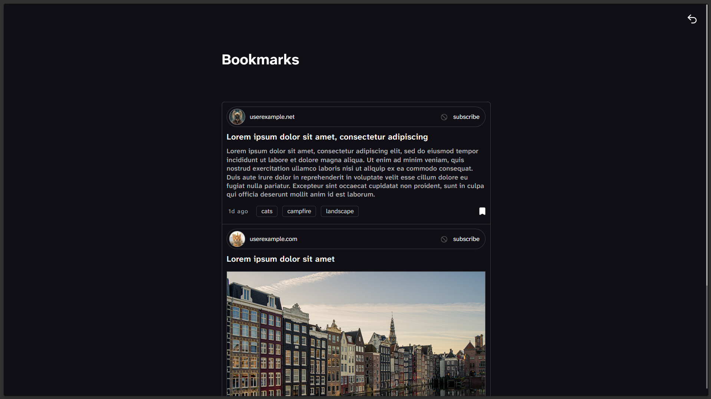
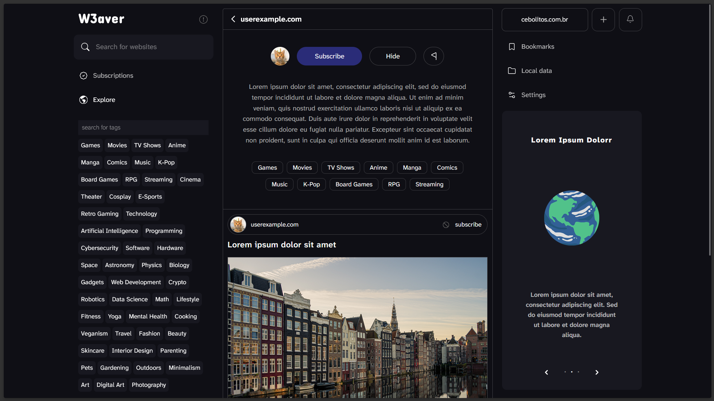

# W3aver 

### W3aver is in its early stages of development !

W3aver is a lightweight web platform where content creators can share links to their websites, allowing readers to save links locally and build a personalized content feed. Designed with simplicity and privacy at its core, W3aver delivers a direct, clean user experience. Unlike modern social networks, it is engineered for maximum data efficiency. Rather than relying on heavy mainstream frameworks, W3aver was initially built with vanilla JavaScript and later transitioned to Svelte to streamline development while keeping the footprint minimal. To keep server costs low and optimize performance, W3aver leverages native browser APIs, such as localStorage, wherever possible. 

## Screenshots:

